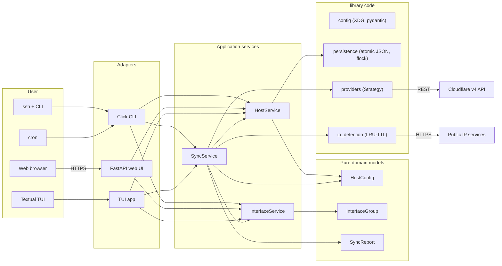

# Architecture

| Field | Value |
|-------|-------|
| Document ID | 0200-CFR-Architecture |
| Version | 2.0.0 |
| Last Updated | 2026-07-14 |
| Maintainer | Mark LaPointe <mark@cloudbsd.org> |
| Status | ACTIVE |
| Classification | INTERNAL |

---

## System Diagram

## Components

| Component | Responsibility |
|-----------|---------------|
| `cli.py` | Top-level Click group. Each subcommand is a thin controller that builds services and delegates. |
| `web/app.py` | FastAPI app. Routes call into `HostService` and `InterfaceService`; no direct persistence access. |
| `tui/app.py` | Textual dashboard. Delegates to services and calls `SyncService.run_once` on `s`. |
| `domain/models.py` | Pure Pydantic models: `HostConfig` (with `interface_group`), `InterfaceGroup`, `SyncReport`. No infra deps. |
| `services/host_service.py` | CRUD + bulk + grouping + interface-group registry. Single owner of persistence writes. |
| `services/interface_service.py` | psutil + UDP-connect default-route detection. Read-only with respect to OS state. |
| `services/sync_service.py` | Orchestrates one cycle (or forever) of `reconcile_host` per group, with the configured `Provider`. |
| `sync.py` | Backward-compat facade re-exporting `reconcile_host`, `run_sync_once`, `sync_forever` from `SyncService`. |
| `config.py` | Pydantic Settings; XDG paths. |
| `persistence.py` | Atomic, lock-guarded JSON store. Defines `HostConfig` (inherits domain) and `InterfaceGroup` (imports domain). |
| `ip_detection.py` | Public IPv4/IPv6 discovery with TTL/LRU cache. |
| `providers/base.py` | Abstract `Provider` strategy. |
| `providers/cloudflare.py` | Concrete Cloudflare implementation. |
| `providers/factory.py` | Strategy factory + registry. |
| `web/csrf.py` | Double-submit-cookie CSRF protection. |

## Layering Rules

* `domain/` depends on nothing else in the project (only pydantic + stdlib).
* `services/` may import `domain/` and `persistence.py` (which itself imports from `domain/`).
* `cli.py`, `web/app.py`, `tui/app.py` may import `services/`, `domain/`, `providers/`, and `persistence.py` for write paths via services.
* `persistence.py` round-trips via `model_dump` / `model_validate`, so schema upgrades only require changes to `domain/models.py`.
* `providers/` is independent of domain and persistence — its only contract is the abstract `Provider`.

## Design Patterns

| Pattern | Where | Notes |
|---------|-------|-------|
| **Strategy** | `providers/base.py` | Each DNS backend is a swappable strategy. |
| **Factory + Registry** | `providers/factory.py` | `build(name, token)` returns the right provider; new providers register on import. |
| **Composition Root** | `cli._build_sync_service` | The CLI builds provider, settings, and persistence before any work starts. |
| **Lazy Singleton** | `config.py:get_settings()` | Re-reads from env after `SIGHUP` / explicit refresh. |
| **Adapter** | `web/csrf.py` | Adapts the CSRF token contract to FastAPI's `Depends` mechanism. |
| **Application Service** | `services/*.py` | Orchestration layer between adapters and infrastructure. |
| **Memento** | `domain.HostConfig` | Reified snapshot of managed host state. |
| **TAOCP §6.4 LRU/TTL** | `ip_detection._TTLCache` | Bounded LRU/TTL cache; capacity 256 sized for the realistic cardinality. |

## TAOCP Influence

The codebase contains a small number of explicit algorithmic choices
documented inline:

* `ip_detection._TTLCache` — bounded LRU/TTL cache (TAOCP §2.6 sorting and
  §6.4 hashing). Capacity 256 is sized for the realistic cardinality (a few
  hosts × a few IP families + negative cache entries).
* `persistence._file_lock` — mutual exclusion via `fcntl.flock` (TAOCP §2.3
  linked allocation analogy: a single linked list of writers).
* `sync.reconcile_host` — three-way state machine (created / updated / deleted)
  with linear scan over the small existing-records set.
* `services.interface_service._udp_local_ip` — kernel-level FIB lookup via
  UDP `connect`; sends no packet (TAOCP §2.6: optimal in O(1) for the
  common case where one default route suffices).

## Interface Groups

A *group* binds a user-meaningful label (e.g. `home-wan`, `vpn-tunnel`) to
an OS interface. Hosts tagged with the same `interface_group` are
reconciled in the same cycle; if the group is bound to a specific
interface, `InterfaceService.resolve_interface(name)` confirms it is up
before syncing.

When the group's `interface_name` is `None`, the OS default route is
used — the common case for a home server with one uplink.

## Data Flow

1. **Configuration**: `Settings(...)` reads env + `.env`, validates fields,
   creates XDG directories with mode 0700.
2. **Persistence**: `load_hosts_config()` and `load_interface_groups()`
   form a transactional boundary via `_file_lock`; writes are atomic
   (mkstemp + fsync + os.replace + dir fsync).
3. **Sync cycle**: SyncService discovers IPv4/IPv6 once → for each
   interface group, resolves the interface → for each member host,
   `reconcile_host(provider, host, ipv4, ipv6)` → counts actions.
4. **Web request**: dependency injects the current user from the JWT
   cookie, the CSRF dependency verifies the form token, handlers call
   `HostService` methods.

## Boundaries

* Network egress: only to Cloudflare REST and a small whitelist of public IP
  endpoints. No arbitrary URL access from user input.
* Filesystem: reads/writes only under `data_dir`, `config_dir`, `cache_dir`.
* Process: single Python process per host service; no fork/exec.

---

## Change Log

| Version | Date | Author | Change |
|---------|------|--------|--------|
| 1.0.0 | 2026-07-14 | Mark LaPointe | Initial architecture document. |
| 2.0.0 | 2026-07-14 | Mark LaPointe | Layered architecture: domain/ + services/ + adapters. Added InterfaceService + grouped sync. |

Last Updated: 2026-07-14
Contact: Mark LaPointe <mark@cloudbsd.org>
Classification: INTERNAL
