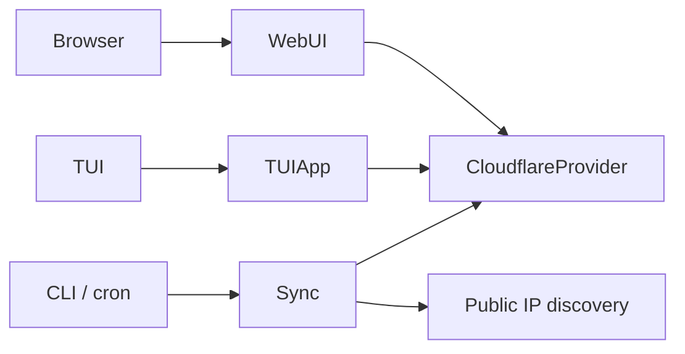

# Cloudflare Smart Dynamic DNS (DynDNS) Service

Smart DynDNS for Cloudflare. Manages multiple hostnames across multiple
zones, supports dual-stack (IPv4 + IPv6) with auto-detection and state
synchronization. Ships with a web UI for occasional management, a TUI for
"set-it-and-forget-it" operation, and a `--sync --once` mode usable from
cron for hosts without a service supervisor.



## Why "Smart"?

Unlike traditional DynDNS clients that only update a single record, this
service:

- **Multi-zone**: Manage hostnames across many Cloudflare zones with one process.
- **Dual-stack**: Auto-detects public IPv4 and IPv6; creates/updates/deletes A
  and AAAA records to match what is actually reachable from the network.
- **State synchronization**: If an IP family disappears (e.g. ISP drops IPv6),
  the corresponding record is removed. Cloudflare always reflects reality.
- **Three operator surfaces**: Web UI (FastAPI + Jinja2), TUI (Textual), and a
  cron-friendly one-shot CLI.

## Features

- **Auto-detection**: Periodically queries a small whitelist of public IP
  endpoints with bounded LRU/TTL caching.
- **Auto-creation, update, cleanup**: Records appear, follow your public IP,
  and disappear when their IP family goes away.
- **Interface groups**: Tag hosts with a label (`home-wan`, `vpn-tunnel`)
  bound to a specific OS interface, or to the OS default route. Sync runs
  per group, with health-checks before applying.
- **Bulk add**: Paste a list of hostnames into the wizard; one save.
- **JWT-protected web UI**: Dashboard + zone-aware wizard for adding hosts;
  logout invalidates all outstanding sessions.
- **CSRF-protected forms**: Session-bound signed tokens + `SameSite=Lax`.
- **bcrypt-hashed admin password** plus per-IP login throttling.
- **TUI dashboard**: Keyboard-first status view (`q` quit, `s` sync now,
  `r` refresh).
- **Cron-friendly mode**: `cloudflare-register sync --once` for systems
  without a service supervisor.
- **Service-ready**: FreeBSD rc.d, systemd unit, plus Debian, FreeBSD-port,
  and pip installers.

## Quick Start

```sh
# 1. Install
python3 -m venv .venv && . .venv/bin/activate
pip install -e .

# 2. Generate a fresh JSON config (random secret + bcrypt-hashed password)
cloudflare-register init          # writes ~/.config/cloudflare_register/config.json

# 3. Edit the config: set cloudflare_api_token at minimum
$EDITOR ~/.config/cloudflare_register/config.json

# 4. Validate
cloudflare-register check-config

# 5. Run
cloudflare-register service       # web UI + sync loop, foreground
# or:
cloudflare-register tui           # TUI dashboard
# or:
cloudflare-register sync          # one cycle, exits (cron-friendly)
```

Configuration resolution order (highest wins):

1. Process environment variables (also systemd `EnvironmentFile`).
2. The file named by `$CLOUDFLARE_REGISTER_CONFIG`.
3. `/etc/cloudflare-register.json` (written by `cloudflare-register init --system`).
4. `$XDG_CONFIG_HOME/cloudflare_register/config.json` (written by `cloudflare-register init`).

There is deliberately no `.env` support. Default paths follow XDG Base Directory:

| Resource | Path |
|----------|------|
| Hosts JSON | `$XDG_DATA_HOME/cloudflare_register/hosts.json` (0600) |
| Config | `~/.config/cloudflare_register/config.json` (0600) |
| Cache | `$XDG_CACHE_HOME/cloudflare_register/` |

Override `XDG_DATA_HOME` etc. to relocate.

## Make Targets

`make` is OS-agnostic — `make install`, `make test`, `make package`, etc.
work the same way on FreeBSD, Linux, and macOS. The active backend is
selected once at parse time from `uname -s`.

```sh
make help            # list targets
make info            # detected OS + active backend + install paths
make install         # editable install + dev extras
make install-runtime # runtime only
make service         # web UI + sync loop, foreground
make web             # web UI only
make tui             # Textual dashboard
make sync            # one-shot sync (cron-friendly)
make check-config    # validate settings + token reachability
make init            # write a strong .env
make interfaces      # list detected interfaces + default route
make hosts           # list managed hosts grouped by interface
make test            # pytest
make test-cov        # pytest with coverage (80 % gate)
make test-e2e        # Playwright E2E + screenshot capture
make lint            # ruff + mypy
make format          # autoformat
make package         # native package for current OS
make package-freebsd | package-debian | package-generic
make install-systemd # Linux
make install-rc      # FreeBSD
make clean           # remove venv + build dirs
make distclean       # also drop caches
```

## Deployment

### FreeBSD

```sh
cd /usr/ports/dns/cloudflare-register && make install clean
sudo cloudflare-register init --system     # writes /etc/cloudflare-register.json
sudo $EDITOR /etc/cloudflare-register.json # set cloudflare_api_token
sysrc cloudflare_ddns_enable=YES
service cloudflare_ddns start
```

(Port skeleton in `contrib/freebsd/`; the plist is generated via `autoplist`.)

### Debian / Ubuntu

```sh
sudo dpkg -i cloudflare-register_0.2.0-1_all.deb
sudo cloudflare-register init --system     # writes /etc/cloudflare-register.json
sudo $EDITOR /etc/cloudflare-register.json # set cloudflare_api_token
sudo systemctl enable --now cloudflare-ddns
```

(`debian/` contains control, rules, postinst, etc.; the unit is installed
and daemon-reloaded by the package.)

### Other Linux / macOS (generic)

```sh
python3 -m venv .venv && . .venv/bin/activate
pip install -e .
cloudflare-register init
$EDITOR ~/.config/cloudflare_register/config.json
cloudflare-register service         # foreground; or run under your supervisor
```

### Cron-only Setup (no systemd / rc.d)

For minimal hosts, run `cloudflare-register sync --once` from cron:

```cron
*/5 * * * *  /opt/cloudflare-register/.venv/bin/cloudflare-register sync --once \
              >> /var/log/cloudflare-register.log 2>&1
```

The `--once` mode finishes a full reconciliation pass and exits; non-zero
on any failure so cron can alert.

## Configuration

Keys are lowercase in the JSON config file and UPPERCASE as environment
variables (env vars override the file). `cloudflare-register init` writes a
config with everything but the API token pre-filled. Required keys for
first run:

| JSON key / env var | Required | Default |
|--------------------|----------|---------|
| `cloudflare_api_token` / `CLOUDFLARE_API_TOKEN` | Yes | placeholder rejected |
| `secret_key` / `SECRET_KEY` | Yes (≥ 32 chars) | placeholder rejected |
| `admin_password_hash` (preferred) or `admin_password` | Yes | placeholder rejected |
| `http_host` / `HTTP_HOST` | No | `127.0.0.1` |
| `http_port` / `HTTP_PORT` | No | `8000` |
| `cookie_secure` / `COOKIE_SECURE` | No | `false` (set `true` behind HTTPS) |
| `sync_interval_seconds` / `SYNC_INTERVAL_SECONDS` | No | `300` |
| `log_level` / `LOG_LEVEL` | No | `INFO` |

The sync loop, web UI, and TUI all refuse to start while placeholder
secrets are in use (`CLOUDFLARE_REGISTER_ALLOW_INSECURE_DEFAULTS=1`
downgrades that to a warning for throwaway experiments). Generate a fresh
secret by hand if needed:

```sh
python -c 'import secrets; print(secrets.token_urlsafe(48))'
```

## Project Structure

```
src/cloudflare_register/
  cli.py              # Click CLI: init, check-config, sync, service, web, tui, interfaces, hosts
  config.py           # pydantic Settings (JSON file + env, XDG-aware)
  exceptions.py       # public exception hierarchy
  ip_detection.py     # async public IPv4/IPv6 discovery (family-validated, TTL cache)
  logging_setup.py    # one-time root logger config
  persistence.py      # atomic JSON, flock-guarded, 0600
  sync.py             # backward-compat facade over SyncService
  domain/
    models.py         # HostConfig (with interface_group), InterfaceGroup, SyncReport
  services/
    host_service.py   # CRUD + bulk + grouping + interface-group registry
    interface_service.py  # psutil + UDP-connect default route
    sync_service.py   # group-aware reconciliation orchestration
  providers/
    base.py           # abstract Strategy
    cloudflare.py     # concrete Cloudflare implementation
    factory.py        # Factory + registry
  web/
    app.py            # FastAPI app + routes (dashboard, wizard, bulk add, group register)
    csrf.py           # session-bound CSRF tokens
    static/           # vendored water.css (no CDN; CSP is default-src 'self')
    templates/        # Jinja2 templates
  tui/
    app.py            # Textual dashboard (groups + interfaces + sync)
  __main__.py         # `python -m cloudflare_register`
contrib/freebsd/      # port skeleton (Makefile, pkg-descr, files/)
debian/               # packaging (control, rules, postinst, ...)
deploy/               # runtime artefacts (systemd unit, rc.d script)
tests/                # pytest suite (unit + service + e2e_web/)
docs/screenshots/     # Playwright E2E output (generated; gitignored)
scripts/
  inject_license.py   # idempotently inserts BSD 3-Clause headers
  secret-scan         # pre-commit credential scanner
.plan/                # CloudBSD planning documents
AGENTS_START_HERE.md  # entry point for autonomous agents
```

## Architecture Notes

The full design lives in `.plan/0200-Architecture.md`. Quick summary:

- **Layered architecture**: `domain/` (pure models) → `services/` (orchestration)
  → `cli.py` / `web/` / `tui/` (adapters) → `providers/` / `persistence.py` /
  `ip_detection.py` (infrastructure).
- **Strategy pattern** in `providers/`. New DNS backends subclass
  `Provider` and register themselves in `factory.py`.
- **Factory** in `providers/factory.py` builds the right strategy from a
  configuration string.
- **Composition root** in `cli.py` wires settings, provider, services.
- **Fail-safe IP detection**: probe responses must parse as an address of the
  requested family; "all probes failed" is distinguished from "family absent"
  (kernel route check), and a transient failure never deletes DNS records.
- **Atomic persistence** with `os.replace` + `fsync` + `flock`; mutations hold
  the lock across the whole read-modify-write.
- **Interface groups** bind user labels to OS interfaces; sync runs per group,
  with probes source-bound to the group's interface address.
- **psutil** chosen for BSD-3 licensing + active maintenance + no root
  requirement (researched 2026-07).

## Development

```sh
make install            # editable + dev deps
make lint               # ruff + mypy
make test               # pytest
make test-cov           # coverage >= 80 %
make format             # ruff auto-format + safe fixes
```

Coverage threshold is enforced via `pyproject.toml`. BSD 3-Clause
license headers are maintained by `scripts/inject_license.py` (run
`make license`).

## Security

- `CLOUDFLARE_API_TOKEN` and `SECRET_KEY` are required at startup: the
  service, web UI, and TUI raise `ConfigError` while placeholders are in use.
- Both the username and the password are verified in constant time;
  `ADMIN_PASSWORD_HASH` (bcrypt) is preferred for production. Failed logins
  are logged, delayed, and locked out per source IP after repeated failures.
- Sessions are HS256 JWTs (PyJWT) in an `HttpOnly; SameSite=Lax` cookie;
  logout bumps a server-side generation counter, invalidating all
  outstanding tokens.
- Form submissions require a CSRF token bound to the session
  (`HMAC(secret_key, session)`), so a planted cookie cannot forge one.
- Every response carries `Content-Security-Policy: default-src 'self'`,
  `X-Frame-Options: DENY`, `nosniff`, `Referrer-Policy: no-referrer`, and
  authenticated pages are `Cache-Control: no-store`. CSS is vendored, not
  loaded from a CDN.
- Hosts/config files are written mode `0600`; data directories `0700`.
- Service drops from root to a dedicated `cloudflare-ddns` user in
  systemd/rc.d packaging; the systemd unit ships a full hardening block.

See `.plan/0100-Security-Overview.md` for the full threat model.

## License

BSD 3-Clause. Copyright (c) 2026, CloudBSD / Mark LaPointe <mark@cloudbsd.org>.

Full text in [`LICENSE`](LICENSE). All rights reserved.
